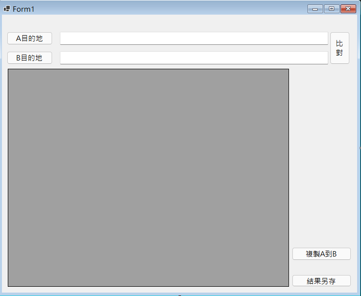

# CopyFiles
# 檔案比對

## 🤖 Description
這是一個可以將兩個不同路徑內的檔案做比對，並自動複製檔案到目的地的程式。

會想開發這個工具是因為我會定期將手機內的相片傳到電腦裡面做備份，但是每次

都要去看上次備份到那一張實在很麻煩，於是這個工具就產生出來啦!

## 🤖 Visuals

## 🤖 Usage
A目的地 -> 來源

B目的地 -> 放置複製檔案的地方

A與B會先比對一次，將A有B沒有的檔案從A那邊複製一份給B。

## 🤖 Support
有任何問題請寄信到 : r0928089102@gmail.com
